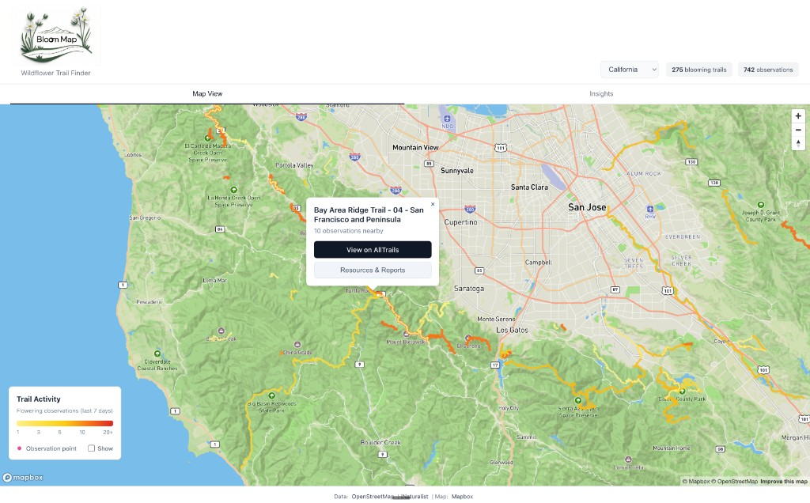

# Bloom Map

A wildflower trail finder for California, Oregon, and Washington. Find the best trails for spotting blooms using iNaturalist observation data and OpenStreetMap trails. Built with React, Vite, Mapbox, and Supabase.

---

## What This Project Is About

Bloom Map helps hikers discover trails with recent wildflower sightings. It combines:

- **Trail data** from OpenStreetMap (via Overpass API) for CA, OR, and WA
- **Wildflower observations** from iNaturalist (last 7 days, research-grade)
- **Precomputed spatial analysis** so trails are ranked by observation density
- **Resources & Reports** for select trails (e.g., Midpen Wildflower Guide, SMC Parks Spring Flowers) — region-specific wildflower guides linked by OSM trail IDs

The app has two main views: **Map View** (interactive map with color-coded trails by bloom activity) and **Insights** (top 10 blooming trails and species breakdown for the selected state).

---

## Screenshots

| Map View | Insights |
|----------|----------|
|  |  |

---

## What the Data Is

| Data | Source | Description |
|------|--------|-------------|
| **Trails** | OpenStreetMap (Overpass API) | Hiking trails as GeoJSON LineStrings with `name`, `osm_way_ids`, `osm_relation_id` |
| **Observations** | iNaturalist API | Research-grade observations (last 7 days) with species, lat/lng, photo |
| **Trail observation counts** | Precomputed (script/cron) | Per-trail counts and species breakdown from spatial join |
| **Resource links** | Supabase (`resource_links`, `resource_trail_links`) | Curated wildflower guides linked to trails by OSM way/relation IDs |

---

## Basic Logic

### Map View

- Trails are styled by **observation count** (1 → light yellow, 3 → yellow, 5 → gold, 10+ → orange, 20+ → red)
- Only trails with at least one nearby observation are shown
- Click a trail → popup with name, observation count, AllTrails link, and (when available) Resources & Reports button
- Resources & Reports: fetches linked resources on demand, cached per trail; button is hidden if no resources

### Insights

- Top 10 trails by observation count
- Top species across all trails
- Data comes from `/api/trail-list` (optimized payload; no full spatial analysis)

### State selection

- CA, OR, WA. Map center/zoom and data reload when state changes.

---

## Data Retrieval and Processing

### High-level flow

```
Overpass API (trails) ──► scripts/generate-trails.js ──► Supabase (trails table)
iNaturalist API ────────► scripts/backfill-observations  ──► Supabase (observations table)
                                                                      │
                                                                      ▼
                                    scripts/refresh-trail-counts ──► trail_observation_counts
                                                                      │
                                                                      ▼
Supabase ◄────────────────────────────────────────────────────── API (Vercel)
                                                                      │
                                                                      ▼
                                                              React frontend
```

### Trails

1. **Backfill** (`scripts/generate-trails.js`): Calls Overpass for each state, fetches hiking trails, extracts OSM way/relation IDs, shrinks GeoJSON (rounded coords), upserts in chunks into `trails` table. Run once (or when OSM data should refresh).
2. **Runtime**: `/api/trails/[state]` reads from `trails`, filters to trails that have entries in `trail_observation_counts`, returns GeoJSON. No Overpass at runtime.

### Observations

1. **Backfill** (`scripts/backfill-observations.js`): Fetches iNaturalist observations for last N days per state, upserts into `observations`.
2. **Cron** (Vercel): Daily crons refresh observations for CA, OR, WA. `refresh-trail-counts` recomputes `trail_observation_counts` after observations update.

### Trail → observation counts

- **Precomputed** in `trail_observation_counts`: 50m buffer around each trail, count observations inside. Species breakdown stored as JSONB.
- If this table is populated: API returns trails + counts; frontend uses `buildResultsFromCounts()` (no client-side spatial work).
- If empty: frontend falls back to `calculateTrailDensity()` (Turf.js buffer + grid-indexed point-in-polygon).

### Resources & Reports

1. **DB**: `resource_links` (id, name, url, description), `resource_trail_links` (resource_id, osm_type, osm_id).
2. **Backfill** (`scripts/backfill-resource-trail-links.js`): Overpass fetch of San Mateo trails → insert (resource_id, osm_type, osm_id) for Midpen and SMC Parks resources.
3. **Runtime**: User clicks trail → frontend calls `/api/resources-for-trail?osm_way_ids=...&osm_relation_id=...` → API queries `resource_trail_links`, then `resource_links`, returns matching resources. Results cached in-memory per trail.

---

## Project Structure

```
├── api/                     # Vercel serverless functions
│   ├── trails/[state].js    # GET trails GeoJSON for state
│   ├── observations.js      # GET observations for state
│   ├── trail-counts.js      # GET trail_observation_counts
│   ├── trail-list.js        # GET top 10 trails + species (Insights)
│   ├── resources-for-trail.js # GET resources linked to trail OSM IDs
│   └── cron/                # Refresh observations, trail counts
├── scripts/
│   ├── generate-trails.js   # Overpass → trails table
│   ├── backfill-observations.js # iNaturalist → observations
│   ├── refresh-trail-counts.js  # Spatial join → trail_observation_counts
│   └── backfill-resource-trail-links.js # San Mateo trails → resource_trail_links
├── src/
│   ├── components/          # Map, ResourcesPanel, Legend, StateSelector
│   ├── services/            # api.js, overpassApi.js, iNaturalistApi.js
│   ├── utils/spatialAnalysis.js # calculateTrailDensity, buildResultsFromCounts
│   └── config/              # states.js, resources.js
├── supabase/
│   ├── schema.sql           # Main tables
│   └── migrations/          # 001_add_taxon_id, 002_resource_links_trail_links
└── docs/
    └── DATA_FILL.md         # Data backfill commands
```

---

## Setup

1. **Supabase**: Create a project, run `supabase/schema.sql` and migrations in SQL Editor.
2. **Env**: Copy `.env.example` to `.env.local`. Set `VITE_MAPBOX_TOKEN`, `SUPABASE_URL`, `SUPABASE_SERVICE_KEY`. For cron, set `CRON_SECRET` (e.g. `openssl rand -hex 32`).
3. **Trails**: `npm run fill-trails` (Overpass → Supabase).
4. **Observations**: `npm run fill-observations` (iNaturalist → Supabase).
5. **Trail counts**: `node scripts/refresh-trail-counts.js`.
6. **Resource trail links** (optional): `node scripts/backfill-resource-trail-links.js` for San Mateo.
7. **Cron**: Deploy to Vercel. Daily crons refresh observations; call `/api/cron/refresh-trail-counts` after.

## Run locally

- **Full stack** (frontend + API): `vercel dev`
- **Frontend only**: `npm run dev` (API will 404 unless `VITE_API_BASE_URL` points to a deployed API).

See [docs/DATA_FILL.md](docs/DATA_FILL.md) for detailed data fill instructions.
